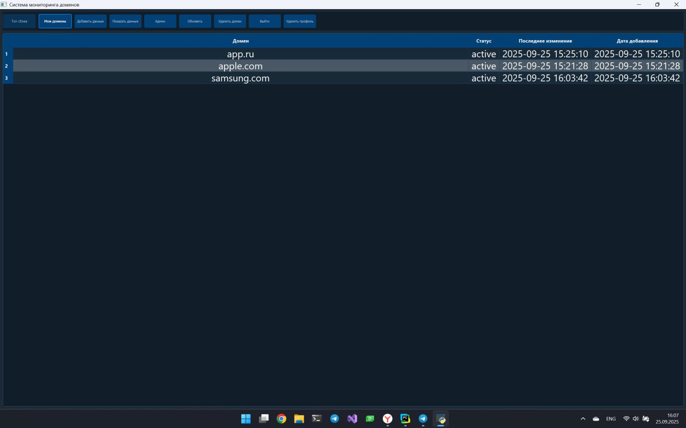
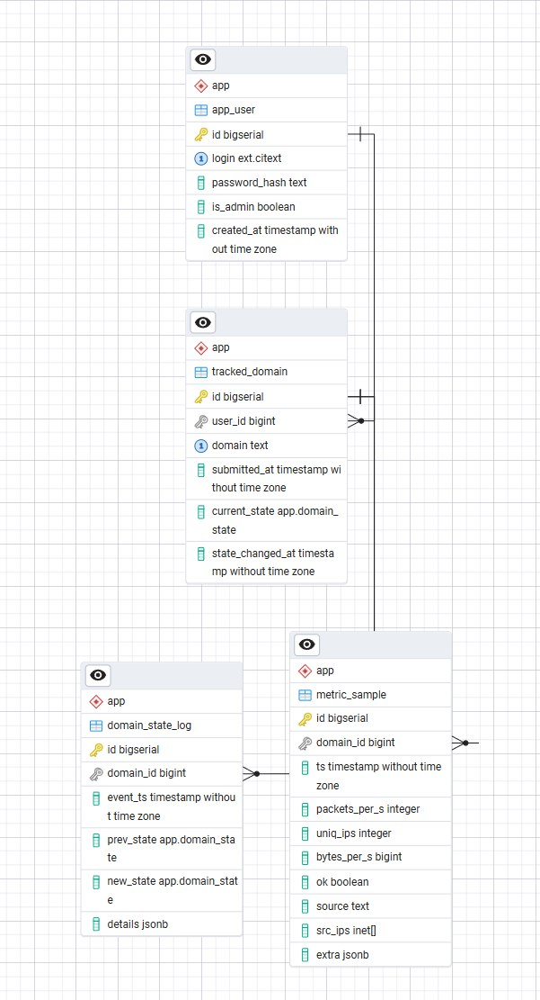

# Domain DDoS Monitoring — Data Science KR 1

> Настольное кроссплатформенное приложение с GUI для **мониторинга доменов** и автоматического **подсчёта количества DDoS-атак по домену**.  
> Стек: **Python 3.12+, PyQt5, PostgreSQL 13+, psycopg2**, ИИ-детектор на **IsolationForest**.

---

## 📸 Скриншоты

**Вход**  


**Регистрация**  


**Список доменов пользователя**  


**Пустое рабочее окно**  


**Добавление домена**  


---

## 🗄️ Структура БД и данные

**ER-диаграмма (схема `app`)**  


**Пользователи (`app_user`)**  


**Домены под мониторинг (`tracked_domain`)**  


**Поток метрик, 10-секундные срезы (`metric_sample`)**  


**Журнал смен состояния домена (`domain_state_log`)**  


> Типы данных: текстовые, числовые, булевы, `timestamp`, ENUM (состояния), массивы (`inet[]`), `JSONB`.  
> Ограничения: `NOT NULL`, `UNIQUE`, `CHECK`. Ключи: `PRIMARY KEY`, `FOREIGN KEY` + `ON DELETE/ON UPDATE`.

---

## 🧠 Что делает приложение (кратко)

1. Пользователь создаёт аккаунт и добавляет **домен** для мониторинга.  
2. Отдельный процесс-детектор **каждые 10 секунд** формирует срез метрик трафика:  
   `packets_per_s`, `uniq_ips`, `bytes_per_s`, `ok` (+ при необходимости `src_ips inet[]`, `extra jsonb`).  
3. Модель **IsolationForest**, обученная на «нормальных» метриках, возвращает **score**.  
   Если `score < threshold` — текущий срез считается **аномальным**.  
4. Поддерживается машина состояний домена `active ↔ ddos`.  
   - при аномальном срезе из `active` → переход в `ddos`;  
   - при неаномальном срезе из `ddos` → возврат в `active`.  
5. **Атакой** считается завершённый эпизод `active → ddos → active`.  
   В момент возврата в `active` счётчик атак **текущего часа** увеличивается на 1.  
6. Поток метрик, журнал смен состояния и почасовые итоги записываются в БД; «топ сбоев» показывает часовые счётчики атак.

---

## 🔎 Как именно фиксируются атаки

### 1) Источник и периодичность
- Генератор/парсер метрик работает **с шагом 10 секунд** на каждый домен.  
- Каждый срез сохраняется в `app.metric_sample(domain_id, ts, …, extra)`.

### 2) Модель и порог
- Используется **IsolationForest** (scikit-learn), обученный на норме.  
- На каждом срезе считаем **score**; задан **порог** `threshold`.  
- Если `score < threshold` → срез **аномальный**.

### 3) Машина состояний домена
- Состояния: `active` (норма) и `ddos` (идёт атака).  
- Переходы:
  - `active` —(аномальный срез)→ `ddos`;  
  - `ddos` —(неаномальный срез)→ `active`.  
- Каждая смена состояния пишет запись в `app.domain_state_log` с `details JSONB`, например:  
  `{ "model": "IsolationForest", "score": <число> }`.

### 4) Подсчёт атак и агрегирование по часам
- **Каждый цикл** `active → ddos → active` = **1 атака**.  
- Счётчик увеличивается **в часе, когда состоялся переход `ddos → active`**.  
- В конце часа сохраняются итоги по домену и выводятся в «топе сбоев».

### 5) Краевые случаи
- Долгая непрерывная атака не увеличивает счётчик повторно, пока домен не вернулся в `active`.  
- Если одиночные всплески нежелательны, можно поднять `threshold` или требовать N подряд аномальных срезов перед входом в `ddos`.

---

## ✨ Возможности

- Регистрация/вход, «Мои домены», добавление/удаление домена.  
- Генерация метрик каждые 10 сек и детекция атак по IsolationForest + порог.  
- Почасовые итоги и «топ сбоев».  
- Подготовленные выражения, транзакции с ROLLBACK, логирование INFO/ERROR.  
- Кроссплатформенность (Windows/macOS/Linux).

---

## 🚀 Установка и запуск

> В репозитории оставлена только папка **`src`**. Запуск — **двумя процессами**.

### Зависимости
```bash
pip install PyQt5 psycopg2-binary python-dotenv scikit-learn numpy
```

### Настройка БД
Создайте базу в PostgreSQL (например, `ds_kr_1`) и заполните файл окружения `src/.env`:
```
PGHOST=127.0.0.1
PGPORT=5432
PGDATABASE=mydb
PGUSER=postgres
PGPASSWORD=palchevsky

# Logging
LOG_LEVEL=INFO

# ML detector
ML_INTERVAL=3
BASELINE_SAMPLES=600
P_ATTACK=0.4
IFOREST_THRESHOLD=-0.1

ADMIN_LOGIN=admin
ADMIN_PASSWORD=123
```
> **Важно:** Автоматического создания схемы и таблиц нет — их нужно создать вручную администратором PostgreSQL.

### Запуск (два терминала в корне репозитория)

**Терминал 1 — детектор (генератор метрик + IsolationForest):**
```bash
python src/ml_detector.py
```

**Терминал 2 — GUI (PyQt5):**
```bash
python src/mainApp.py
```

Зайдите под своим логином, добавьте домен и наблюдайте, как «журнал состояний» и «топ сбоев» обновляются по мере фиксации атак.

---

## 🛠️ Технологический стек
- **GUI**: PyQt5  
- **База данных**: PostgreSQL (ENUM, `inet[]`, JSONB, PK/FK/ON DELETE/ON UPDATE, индексы)  
- **Доступ к БД**: psycopg2 (prepared statements, транзакции)  
- **ML**: IsolationForest (scikit-learn), порог по score  
- **Конфигурация**: `.env` через `python-dotenv`

---

## 👥 Команда и вклад
- **QA/Docs/Тимлид** — тестовые сценарии, README, скриншоты/видео, распределение задач.  
- **Архитектор БД** — схема, ограничения, индексы, ссылочная целостность.  
- **Бэкенд/DAO** — доступ к БД, транзакции, обработка ошибок, загрузка метрик.  
- **GUI-ввод** — формы (домен, настройки порогов).  
- **GUI-отчёты** — списки доменов, таблицы, фильтры, экспорт.

---

## 📄 Лицензия
Учебный проект для контрольной работы. Использование — по согласованию с преподавателем/кафедрой.
