# Domain DDoS Monitoring — Data Science KR 1

> Настольное кроссплатформенное приложение с GUI для **мониторинга доменов** и автоматического **подсчёта количества DDoS-атак по домену**.  
> Стек: **Python 3.12+, PyQt5, PostgreSQL 13+, psycopg2**, ИИ-детектор на **IsolationForest**.

---

## 📸 Скриншоты

**Вход**  
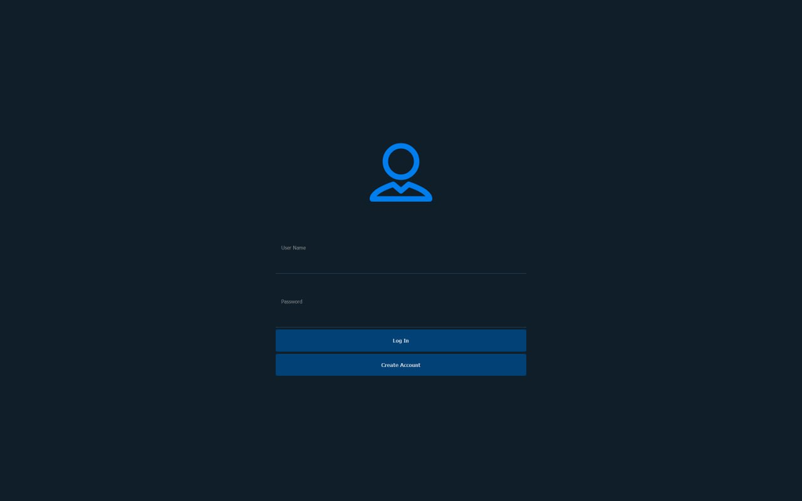

**Регистрация**  
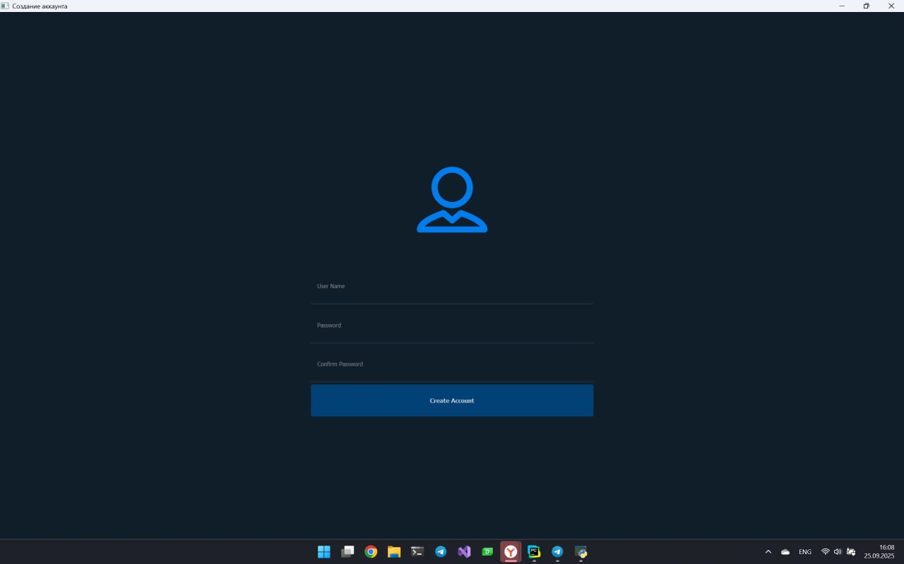

**Список доменов пользователя**  
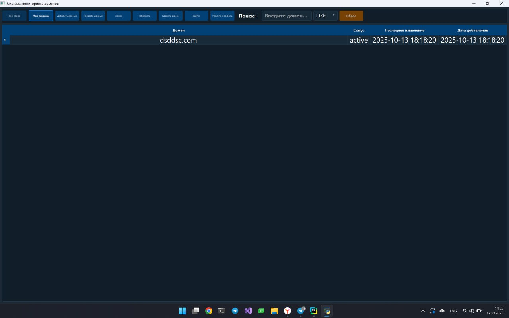

**Пустое рабочее окно**  
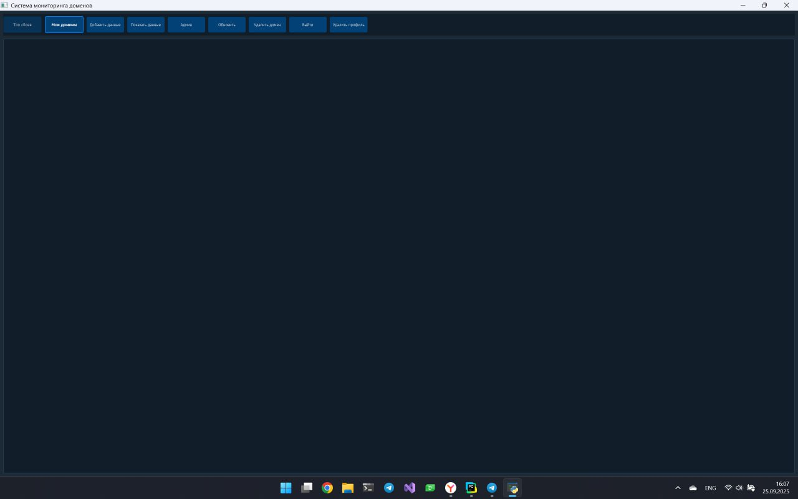

**Добавление домена**  
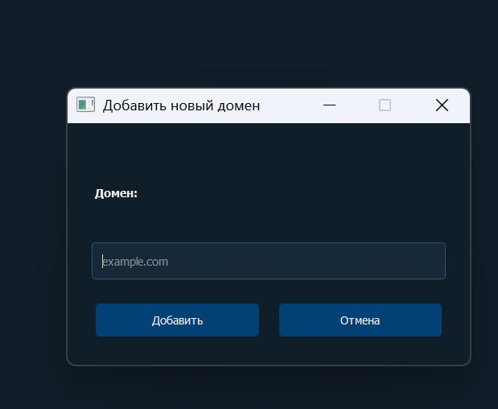

**Меню администратора**  
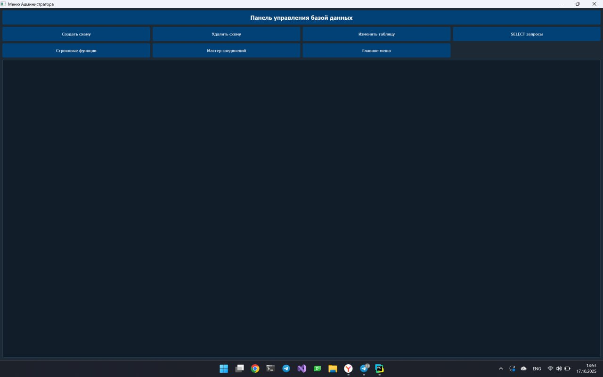

**SELECT конструктор**  
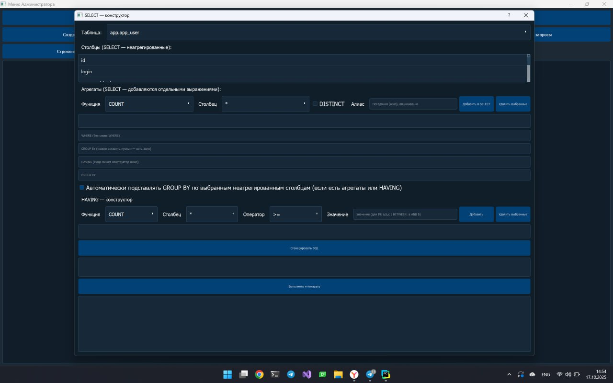

**Строковые функции**  
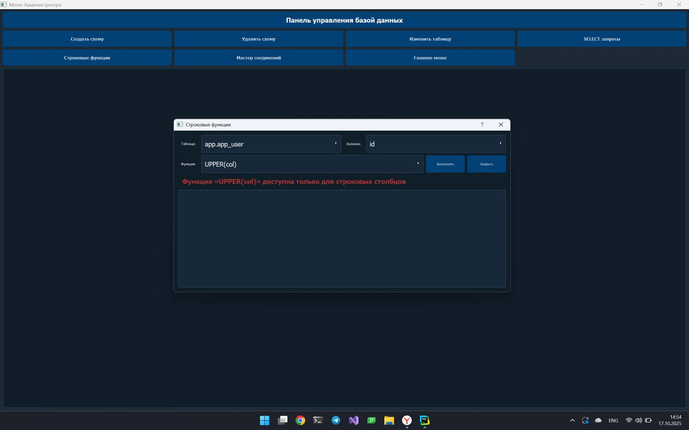

**Мастер соединений**  
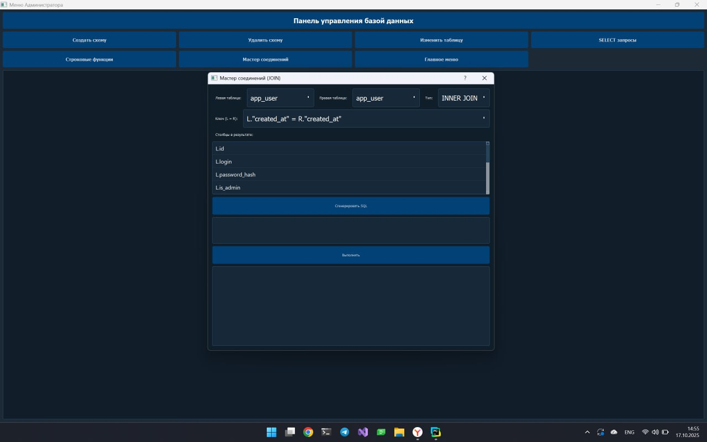

**ALTER TABLE конструктор**  
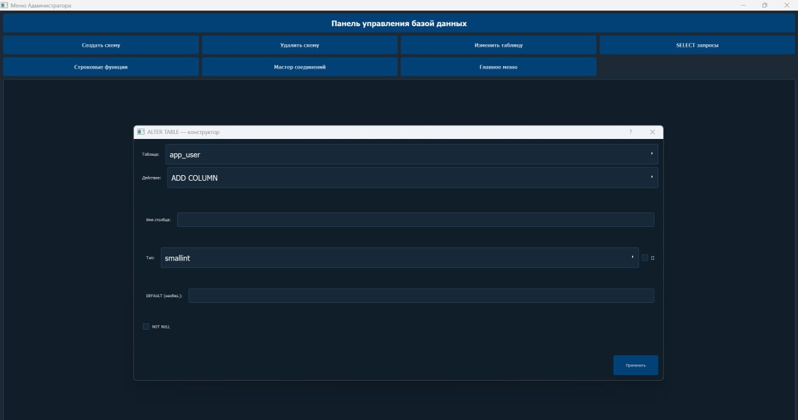

---

## 🗄️ База данных и данные

**ER-диаграмма (схема `app`)**  
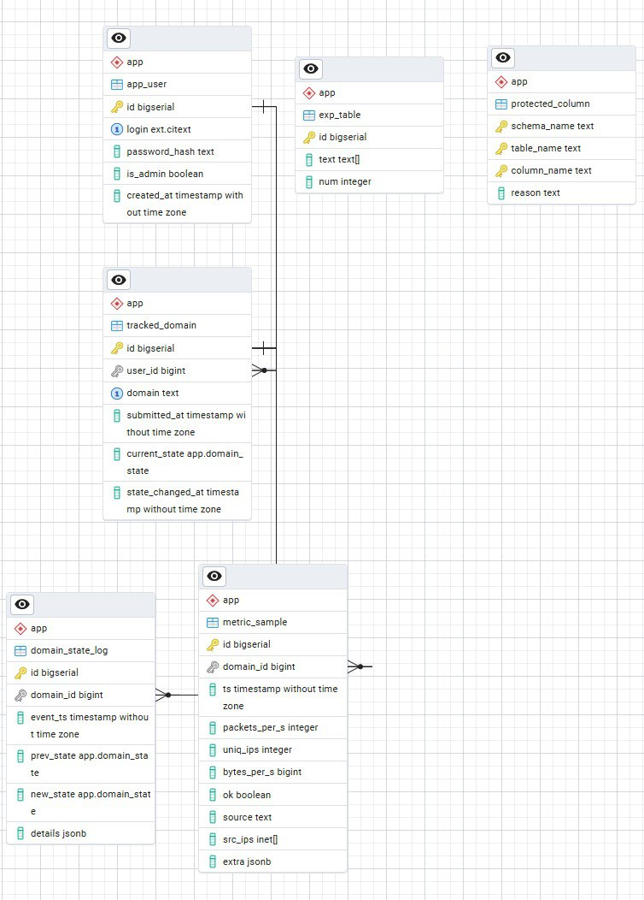

**Пользователи (`app_user`)**  
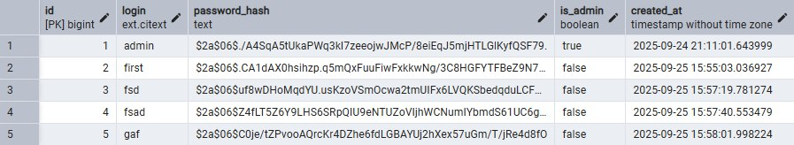

**Домены под мониторинг (`tracked_domain`)**  
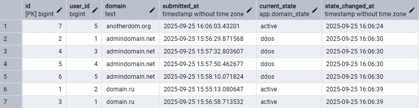

**Поток метрик, 10-секундные срезы (`metric_sample`)**  
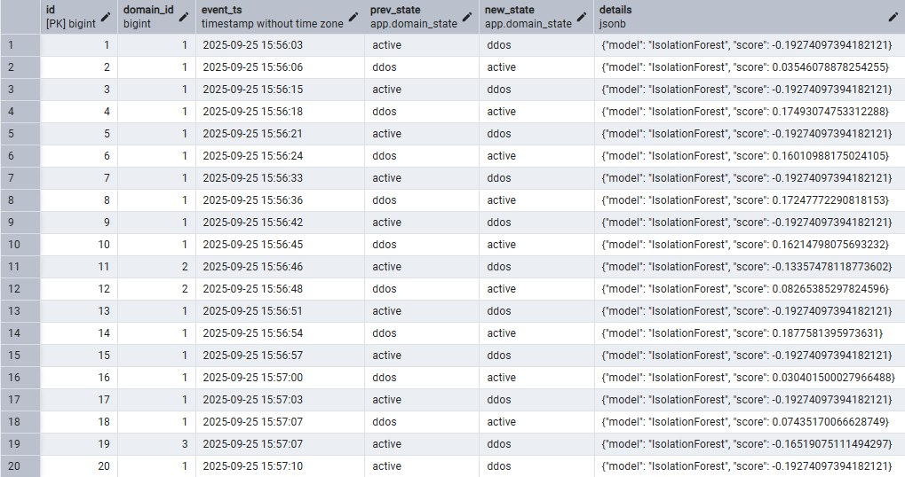

**Журнал смен состояния домена (`domain_state_log`)**  
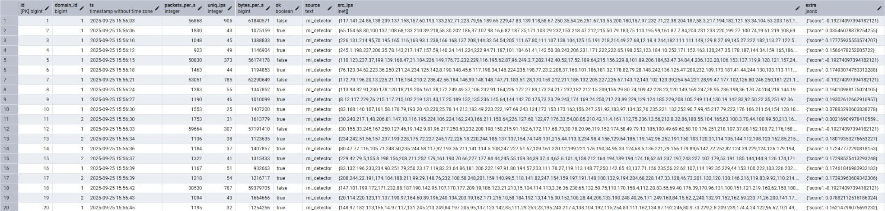

**Таблица защищенных столбцов (`protected_column`)**  
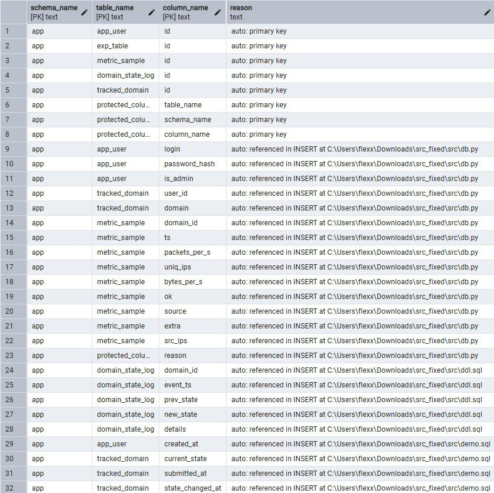

> Типы: текстовые/числовые/булевы, `timestamp`, ENUM (состояния), массивы (`inet[]`), `JSONB`.  
> Ограничения: `NOT NULL`, `UNIQUE`, `CHECK`, `PRIMARY/FOREIGN KEY` + `ON DELETE/ON UPDATE`.

---

## 🧠 Логика детекции (что делает приложение)

1. Пользователь создаёт аккаунт и добавляет **домен** для мониторинга.  
2. Отдельный процесс-детектор каждые **10 секунд** генерирует/собирает метрики:  
   `packets_per_s`, `uniq_ips`, `bytes_per_s`, `ok` (+ при необходимости `src_ips inet[]`, `extra jsonb`).  
3. Модель **IsolationForest**, обученная на «нормальных» метриках, возвращает **score**. Если `score < threshold` — срез **аномальный**.  
4. Домен имеет два состояния: `active` и `ddos`.  
   - при аномальном срезе из `active` → переход в `ddos`,  
   - при неаномальном срезе из `ddos` → возврат в `active`.  
5. **Атакой** считается завершённый эпизод `active → ddos → active`. В момент возврата в `active` счётчик атак **текущего часа** увеличивается на 1.  
6. Метрики, журнал смен состояний и почасовые счётчики попадают в БД; в интерфейсе выводится «топ сбоев».

---

## ✨ Возможности GUI

### Основные (КР-1)
- Регистрация/вход, «Мои домены», добавление/удаление домена.
- Поток метрик (каждые 10 сек) и авто-подсчёт атак.
- Журнал смен состояний и «топ сбоев».
- Подготовленные выражения, транзакции с ROLLBACK и понятные сообщения об ошибках.
- Кроссплатформенность (Windows/macOS/Linux).

### Новое для КР-2 (расширенный SQL без ручного ввода)

#### 1) Окно вывода данных — **встроенные фильтры на подзапросах**
- Конструктор условий с поддержкой вложенных и коррелированных подзапросов.  
- Операторы **`ANY` / `ALL` / `EXISTS`** доступны из выпадающих списков.  
- Можно добавлять подзапрос как источник значений или как условие существования; все параметры задаются формами.

#### 2) Модуль **пользовательских типов**
- Создание и управление типами **ENUM** и **составными типами** (composite).  
- Использование созданных типов при создании таблиц через GUI.  
- Просмотр/редактирование/удаление пользовательских типов — без ручного SQL.

#### 3) Поиск по строкам — **SIMILAR TO / NOT SIMILAR TO**
- Дополнительно к `LIKE/ILIKE` и POSIX-регэкспам реализована работа с **`SIMILAR TO`** и отрицанием **`NOT SIMILAR TO`**.  
- Выбор столбца и шаблона осуществляется через элементы управления.

#### 4) Инструменты **агрегирования и группировки** в окне SELECT
- Выбор агрегатных функций (**COUNT, SUM, AVG, MIN, MAX**).  
- Настройка **GROUP BY** по выбранным полям и фильтрация групп через **HAVING**.  
- Результат — сводная таблица, доступна сортировка, фильтры и экспорт.

#### 5) Конструктор **CASE**
- Визуальная форма для добавления вычисляемых столбцов вида  
  `CASE WHEN … THEN … [WHEN … THEN …] ELSE … END`.  
- Условия и значения задаются в полях, можно добавлять несколько веток.

#### 6) Работа с **NULL**: `COALESCE` и `NULLIF`
- Подстановка дефолтов вместо `NULL` (COALESCE) и преобразование совпадающих значений в `NULL` (NULLIF).  
- Всё настраивается чекбоксами и полями ввода.

---

## 🛡️ Администратор (отдельная кнопка и панель)
Все действия с БД вынесены в «Админ-панель» (доступна только пользователям с правами админа):

- **Создать схему**  
- **Удалить схему**  
- **ALTER TABLE** (редактор структуры: столбцы, типы, PK/FK/UNIQUE/CHECK, комментарии)  
- **SELECT** (расширенный конструктор, подзапросы, агрегаты/группы/HAVING)  
- **Search** (LIKE/ILIKE, POSIX-регэкспы, **SIMILAR TO**)  
- **Строковые функции** (UPPER/LOWER, SUBSTRING, TRIM, LPAD/RPAD, CONCAT, LEFT/RIGHT)  
- **Мастер соединений** (JOIN: INNER/LEFT/RIGHT/FULL, выбор ключей и полей)  
- **Главное меню** (возврат в пользовательский режим)

> В админ-режиме все DDL/DML выполняются транзакционно с предпросмотром сгенерированного SQL и логированием.

---

## 🚀 Установка и запуск

> В репозитории оставлена только папка **`src`**. Запуск — **двумя процессами**.

### Зависимости
```bash
pip install PyQt5 psycopg2-binary python-dotenv scikit-learn numpy
